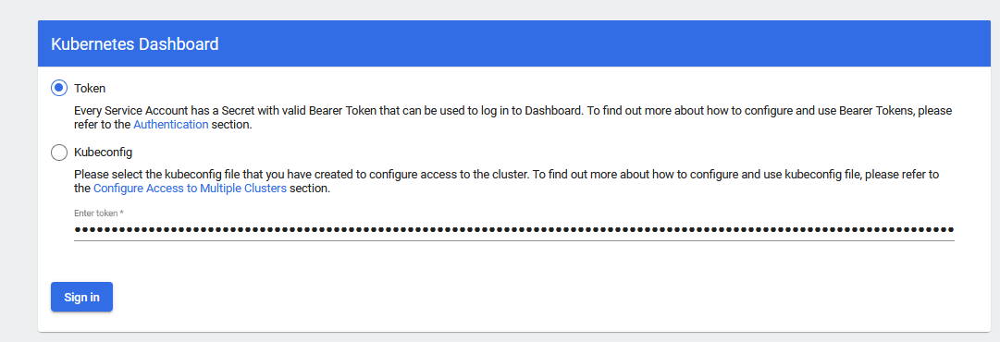

## Beschreibung
In der LB2 werde ich mittels Docker einen Image einer einfachen Webapplikation erstellen und der dann über Container Orchestrierung (Kubernetes) automatisch bereitstellen.<br>

**Erster Teil**<br>
Mit diesem Befehl führt man der ersten Teil der LB2 aus und stellt einen einfachen Node.JS Web-App in einem Container bereit.
```shell
docker run --name web_app -p 8080:8080 michalis07/webapp
```


**Inhaltsverzeichnis**
- [Beschreibung](#beschreibung)
- [Voraussetzungen](#voraussetzungen)
- [Funktionen](#funktionen)
- [Docker](#docker)
  - [Vorbereitung](#vorbereitung)
  - [Docker Hub Konto anbinden](#docker-hub-konto-anbinden)
  - [Dockerfile](#dockerfile)
  - [Docker Container starten](#docker-container-starten)
- [Kubernetes Orchestrierung](#kubernetes-orchestrierung)
  - [Initialisierung und Erste Schritte](#initialisierung-und-erste-schritte)
  - [Nodes und Pods definieren](#nodes-und-pods-definieren)
  - [Monitoring mit Grafana und Prometheus](#monitoring-mit-grafana-und-prometheus)
  - [Vagrantfile Cluster](#vagrantfile-cluster)
- [Testing](#testing)
- [Reflexion](#reflexion)
- [Quellen](#quellen)

## Voraussetzungen
Die Voraussetzungen fürs folgende Projekt sind folgende:

- GitHub
- Git/Bash
- Virtualbox (in diesem Fall MAAS der TBZ Cloud)
- Docker
  -  Kenntnisse von Vorteil
  -  Docker Hub Account
-  Kubernetes
   - Kenntnisse von Vorteil
   - Genügend Ressourcen
- Browser

## Funktionen
- Die node.js Applikation wird im Docker Image namens **webapp** packetiert und als Container gestartet. Sie stellt eine einfache HTML-Seite auf Port 8080 dar. 

## Docker
### Vorbereitung
Zuerst gehe ich auf WireGuard, um das VPN der TBZ-Cloud zu aktivieren. Danach gebe ich folgendes Befehl im Git/Bash ein.
```shell
ssh ubuntu@10.1.43.13
```
 Das Passwort finde ich heraus, wenn ich auf der HTTP-Seite des Servers gehe und unter **Accessing** die `data/.ssh/passwd-Datei` öffne, bekomme ich das Passwort.

Zuerst führe ich das um den Server zu aktualisieren
```shell
apt-get update && apt-get upgrade -y
```

### Docker Hub Konto anbinden
Mit diesem Befehl lege ich meinen Docker Hub Konto an und wird für mein Passwort gefordert.
```shell
docker login --username=michalis07
```
Bei erfolgreichem Anlegen kann ich ohne Hindernis Images auf Docker Hub hochzuladen ('pushen'). Der erfolgreicher Zugriff wird da dargestellt.<br> 


Der Inhalt der Website ändere ich, indem ich 'nano /views/home.pug' eingebe und das HTML-Content anpassen.


### Dockerfile
Das Dockerfile sieht wie folgt aus.
```dockerfile
FROM node:current-slim

LABEL MAINTAINER=marcello.calisto@tbz.ch

# Kopiere als erstes den Source-Code ins Verzeichns /src des Containers
COPY . /src

# Wechsle ins Verzeichnis /src und installiere da den NPM (Node Package Manager), welche alle Abhängigkeiten installiert
RUN cd /src; npm install

# Die App hört auf dem Port 8080
EXPOSE 8080

# Wechsle ins Verzeichnis /src und starte die App, wenn der Container gestartet wird
CMD cd /src && node ./app.js
```

Ich wechsle wieder im Home-Verzeichnis mit
```shell
cd .. 
docker image build -t michalis07/webapp:1.0 .
``` 
um das Image mit dem Repo-Name michalis07/webapp, mit dem Tag 1.0 und das Content, bzw. das Dockerfile vom jetzigen Verzeichnis zu nehmen.

Mit 
```shell
docker image push michalis07/webapp:1.0
```
lade ich das auf der Docker Hub unter mein Account hoch.

### Docker Container starten
Das Docker Container starte ich mit und bekomme die SHA256 ID des Containers.
```shell
docker container run -d --name michalis-web -p 8080:8080 michalis07/webapp
```


Mit diesen beiden Varianten kann man den laufenden Container als Prozess ansehen. Der Zugriff auf die HTML-Seite erfolgt mit der URL `10.1.43.13:8080`.
```shell
docker ps | grep -i michalis-web
docker container ls | grep -i michalis-web
```

## Kubernetes Orchestrierung
### Initialisierung und Erste Schritte
Auf meinen lokalen Client (Host) installiere ich **KubeCTL**. Im Verzeichnis C:\Users\apoll\ erstelle ich den benötigten Ordner .kube und öffne CMD/GitBash, damit ich diesen Befehl in dem besagten Ordner eingeben kann. 
```shell
curl -LO https://dl.k8s.io/v1.21.0/bin/windows/amd64/kubectl.exe.sha256
```
Wenn die binäre Datei erfolgreich Danach gebe ich `kubectl.exe` im cmd rein und kubectl wird installiert.
Mit `kubectl version` kann die Version überprüft werden.

Nun erstelle ich den Verzeichnis **.kube** und wechsle zu dem, um die Konfigurationsdatei für das Kubernetes Cluster abzulegen, erstelle ich die leere Datei **config**.
Diesen Inhalt kopiere ich rein und speichere es ab.

```yml
apiVersion: v1
clusters:
- cluster:
    certificate-authority-data: [certificate-authority-key]
    server: [IP-Address:6443]
  name: kubernetes
contexts:
- context:
    cluster: kubernetes
    user: kubernetes-admin
  name: kubernetes-admin@kubernetes
current-context: kubernetes-admin@kubernetes
kind: Config
preferences: {}
users:
- name: kubernetes-admin
  user:
    client-certificate-data: [certificate-key]
    client-key-data: [key-key]
```

Der .kube Ordner soll wie folgt aussehen.

```shell
apoll@I-320s-MIC MINGW64 ~/.kube
$ ls -l
total 46748
drwxr-xr-x 1 apoll 197609        0 Jun 21 15:49 cache/
-rw-r--r-- 1 apoll 197609     5585 Jun 21 15:48 config
-rwxr-xr-x 1 apoll 197609 47859200 Jun 21 15:45 kubectl.exe*
```
Um zu schauen, ob kubectl erfolgreich installiert und mit der Config-Datei auf das Dashboard zu kommen, gebt man diesen Befehl ein.
```shell
$ kubectl cluster-info

Kubernetes control plane is running at https://10.1.43.13:6443
KubeDNS is running at https://10.1.43.13:6443/api/v1/namespaces/kube-system/services/kube-dns:dns/proxy
```
Die aktuell laufenden Pods (Hosts) sind mit diesem Befehl ersichtlich.
```shell
$ kubectl get pods -o wide

NAME                             READY   STATUS    RESTARTS   AGE
eclipse-theia-79dcdc756d-4ckbp   1/1     Running   1          58d
```

Mit diesem Befehl sehe ich alle Services die auf diesem Kubernetes-Cluster momentan laufen.

```shell
$ kubectl get svc

NAME            TYPE           CLUSTER-IP      EXTERNAL-IP   PORT(S)          AGE
eclipse-theia   LoadBalancer   10.107.23.108   <pending>     3000:32400/TCP   58d
kubernetes      ClusterIP      10.96.0.1       <none>        443/TCP          58d
```
Nun kommt man auf das Dashboard wie folgt; man gebt diesen Befehl im Bash ein und der leitet der 10.43.1.13:6443 aufs localhost:8001.

```shell
kubectl --kubeconfig config proxy
```
Auf das Dashboard greift man über diesen [URL](http://localhost:8001/api/v1/namespaces/kubernetes-dashboard/services/https:kubernetes-dashboard:/proxy/) an. Danach muss man Token auswählen und den Token, der auf der Homepage des TBZ-VMs (10.43.1.13 unter dem Punkt Cluster-Info > Token) zu finden ist, eingeben.<br>


Das Dashboard sieht dann wie folgt aus. 

### Nodes und Pods definieren
Als Vorbereitung werde ich die Repository von Marcello auf der VM klonen. Dafür erstelle ich den Ordner `TEMP_K8s` und führe den untenstehenden Befehl aus.

```shell
$ sudo git clone https://gitlab.com/ser-cal/cal_kubernetes.git

$ cd cal_kubernetes | ls -l

total 24
drwxr-xr-x 2 root root 4096 Jun 28 12:39 Deployments
drwxr-xr-x 2 root root 4096 Jun 28 12:39 Pods
-rw-r--r-- 1 root root 4816 Jun 28 12:39 README.md
drwxr-xr-x 2 root root 4096 Jun 28 12:39 Services
drwxr-xr-x 2 root root 4096 Jun 28 12:39 images
```
Um das erste Pod im Verzeichnes `Pods` zu starten, muss das Pod-Manifest deployed werden. Dieses Pod-Manifest sieht wie folgt aus und definiert der Container mit meinem Image, den ich auf Docker Hub zugleich publiziert und auch lokal habe.

```yml
## M. Chatzimichalis: getestet am 28.6.2021
## Beispiel Pod YAML:
apiVersion: v1
kind: Pod
metadata:
  name: michalis-pod
  labels:
    app: web

spec:
  containers:
  - name: michalis-container
    image: michalis07/webapp:1.0
    ports:
    - containerPort: 8080
```
Um den Pod nun zu deployen gebe ich diesen Befehl ein. Mit dem Befehl `kubectl get pods -o wide` zeige ich alle Dienste.

```shell
$ sudo mv calisto-pod.yaml michalis-pod.yaml
$ kubectl apply -f michalis-pod.yaml
  
  pod/michalis-pod created

$ kubectl get pods -o wide

NAME        READY  STATUS    RESTARTS  AGE   IP         NODE             
michalis-pod 1/1   Running  0         97s   10.244.0.20 m300-13-st18a-cal
``` 

Der Service bekommt eine eigenständige, ansprechbare IP und wird in dem File `TEMP_K8s/cal-kubernetes/Services/michalis-svc.yaml` definiert.
```yaml
## M.Chatzimichalis: getestet am 04.07.2021
## Beispiel SVC-YAML:
apiVersion: v1
kind: Service
metadata:
  name: michalis-svc
  labels:
    app: hello-world-michalis
spec:
  type: NodePort
  ports:
  - port: 8080
    nodePort: 30001
    protocol: TCP
  selector:
    app: web
```

Nun werde ich über das Deployment u.a die Anzahl Pods definieren. Die Datei heisst `michalis-deployment.yml`. Mit `kubectl apply -f michalis-deployment.yml` stelle ich das Deployment-File mit den 6 Pods bereit.
```yaml
# Simple deployment used to deploy and manage the app in nigelpoulton/ps-web:1.0
apiVersion: apps/v1
kind: Deployment
metadata:
  name: web-deploy
  labels:
    app: web
spec:
  selector:
    matchLabels:
      app: web
  replicas: 6
  minReadySeconds: 5
  strategy:
    type: RollingUpdate
    rollingUpdate:
      maxUnavailable: 0
      maxSurge: 1
  template:
    metadata:
      labels:
        app: web
    spec:
      terminationGracePeriodSeconds: 1
      containers:
      - name: hello-pod
        image: nigelpoulton/getting-started-k8s:1.0
        imagePullPolicy: Always
        ports:
        - containerPort: 8080
```
Nun sind meine Pods durch den Befehl `kubectl get pods -o wide` ersichtlich.
```bash
$ kubectl get pods -o wide
NAME                             READY   STATUS    RESTARTS   AGE    IP            NODE                NOMINATED NODE   READINESS GATES
eclipse-theia-79dcdc756d-4ckbp   1/1     Running   1          65d    10.244.0.19   m300-13-st18a-cal   <none>           <none>
michalis-pod                     1/1     Running   0          6d6h   10.244.0.20   m300-13-st18a-cal   <none>           <none>
web-deploy-566bd8fc84-276lc      1/1     Running   0          51s    10.244.0.31   m300-13-st18a-cal   <none>           <none>
web-deploy-566bd8fc84-6tjn5      1/1     Running   0          51s    10.244.0.32   m300-13-st18a-cal   <none>           <none>
web-deploy-566bd8fc84-82vx7      1/1     Running   0          51s    10.244.0.30   m300-13-st18a-cal   <none>           <none>
web-deploy-566bd8fc84-8r6k8      1/1     Running   0          51s    10.244.0.29   m300-13-st18a-cal   <none>           <none>
web-deploy-566bd8fc84-9gpxg      1/1     Running   0          51s    10.244.0.27   m300-13-st18a-cal   <none>           <none>
web-deploy-566bd8fc84-bgdhc      1/1     Running   0          51s    10.244.0.28   m300-13-st18a-cal   <none>           <none>
```
Im K8s Dashboard sind sie ebenfalls ersichtlich.

 

### Monitoring mit Grafana und Prometheus
Um mein Cluster mit hilfreichen Dashboards zu überwachen, könnte ich mich auf das GitHub-Projekt vom [carlosedp](https://github.com/carlosedp/cluster-monitoring) hinweisen. 

Auf der TBZ VM werde ich golang installieren.
```bash
$ sudo apt install golang-go -y
$ export PATH=$PATH:$(go env GOPATH)/bin
$ export GOPATH=$(go env GOPATH)
```
Die Repo muss jetzt geklont werden im Verzeichnis `~/TEMP_K8s/`.

```bash
$ sudo git clone https://github.com/carlosedp/cluster-monitoring.git
```

Nun ändern wir folgende Werte. Die Master-Node IP-Adresse. Um die Master Node IP zu finden, gebe ich kubectl get node -o wide ein und lese die **Internal-IP** heraus
```bash
k3s: {
    enabled: true,
    master_ip: ['10.1.43.13'],
  },

// Domain suffix for the ingresses
  suffixDomain: '10.1.43.13.nip.io',
 
// Setting these to false, defaults to emptyDirs.
  prometheus: true,
  grafana: true,
```
Mit diesem Befehl werden alle nötige Pakete und Abhängigkeiten geladen
```bash
$ sudo make vendor
```
Leider habe ich einige Fehlermeldungen gekriegt, vermutlich wegen der 1-Node Cluster, den ich führe und habe den Projekt gekappt und somit die Repository mit `sudo rm -rf cluster-monitoring` gelöscht.

### Vagrantfile Cluster

Dieser Versuch einen Vagrantfile mit 1 Master-Node und 3 Worker-Nodes zu erstellen, erlitt auch unter Problematik. Die Files sind da zu finden.
* [Link zur Vagrantfile](/LB2/Vagrantfile)
* [Link zur Main-Shell-Script](/LB2/install_microk8s_main.sh)
* [Link zur Worker-Shell-Script](/LB2/install_microk8s_worker.sh)

## Testing

Der Zugriff auf die Kubernetes Dashboard funktioniert erfolgreich. 


## Reflexion 

Die LB2 und konsequente Einführung in der Welt von Container-Orchestration mit Kubernetes fand ich spannend. Es war lehrreich, um diese Technologie kennenzulernen, jedoch fand ich den Einstieg und Implementierung ein bisschen schnell. An diesem Punkt bin ich teilweise schuld, da ich mich zu Hause über alle Aspekte von Kubernetes mehr informieren könnte, jedoch müsste ich die BMS priorisieren. Das Potential, das Kubernetes einem/einer Firma ermöglicht ist enorm und werde sicher in den nächsten paar Monate schauen, dass ich im privaten Umfeld mich tiefer auseinandersetzen kann, sodass ich evtl. die Chance an der IPA packe und einen Dienst mit Kubernetes einrichte und meiner Firma zur Verfügung stelle.

Die Expertise vom Marcel Bernet fand ich bei seiner GitHub-Repository mehr als die Besuche vor-Ort, da ich in den meisten Fällen über die Thematik zu wenig wusste oder mir gar keine Fragen eingefallen sind. 

## Quellen

Die Beispielsaufgabe mit dem Node.js Applikation besteht von der GitLab Repository vom Marcello Calisto. [Link zur Repository](https://gitlab.com/ser-cal/Container-CAL-webapp_v1/-/tree/master/)
